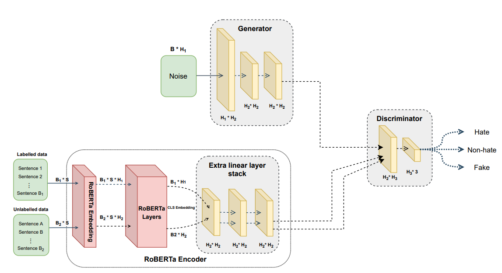
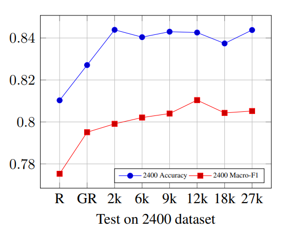
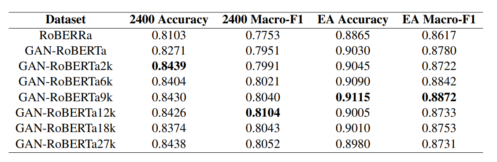

# GAN_RoBERTa

## Introduction
Code repository for the paper: <br/>
<b>GAN-RoBERTa: a Robust Semi-Supervised Model for Detecting Anti-Asian COVID-19 Hate Speech on Social Media</b>

 In this repository, we provide our research code for training and testing our proposed method for the hate speech detection classification task.


GAN-RoBERTa is an effective semi-supervised generative adversarial network based methodology for COVID-19 related hate speech detection. GAN-RoBERTa utilizes the RoBERTa encoder as a feature extractor to generate latent embedding from labelled([EA dataset](https://zenodo.org/record/3816667#.YUhhjrgzaUk)) and unlabelled data([CLAWS dataset](http://claws.cc.gatech.edu/covid/#dataset)) in the training process. Our experiment results indicate that with the collaborative training with GAN and RoBERTa and specific participation of unlabelled data in the optimization process, the model's Macro-F1 score is significantly boosted from 0.77 to 0.82.</br>


<p align="center">
  
</p>

#### GAN-RoBERTa consists of 3 main components: 
(1) A RoBERTa encoder extracts sentence-level features from labelled B<sub>1</sub> * S and unlabelled data B<sub>2</sub> * S, along with an extra linear layers stack that compress the sentence-level features into B * H<sub>2</sub>.  <br/>
(2) A generator that transforms the random noise B * H<sub>1</sub> into B * H<sub>2</sub>.  <br/>
(3) A discriminator classifies the sentence-level embedding into three categories (Hate, Non-hate, Fake). Each linear layer is concatenated with the Leaky-ReLU activation layer and dropout.

In the following plot and table, the performances of GAN-RoBERTa are reported for [2400 public annotated dataset](http://claws.cc.gatech.edu/covid/#dataset) from [Racism is a Virus: Anti-Asian Hate and Counterhate in Social Media during the COVID-19 Crisis](https://arxiv.org/abs/2005.12423). We compared in detail the effects of models with different ratio of unlabeled data on the 2400 test set.

<p align="center">
  
</p>

Based on our experiment, GAN-RoBERTa oversocre the RoBERTa-only model on 2400 test dataset and with the increment of unlabelled data, the accuracy reaches the peak after adding 2k unlabelled data, and Macro-F1 reaches its peak after adding 12k unlabelled data.

<p align="center">
  
</p>

## Installation instructions
All experimetn are produced by torch 1.9-cu. We suggest to use python 3.8/3.9 to reproduce the whole experiment. All dependency packages are include in the requirement.txt. Note: Our CUDA drive version is 11.1, please make sure the torchtoolkit is compatiable with your CUDA version.
### Set up with pip

```
pip install -r requirements.txt
```
Basically all dependent packages of this project are up-to-date, so it will be easy to reproduce the entire experiment.

### Set up with conda

```
conda create --name GAN_RoBERTa python=3.9
conda activate GAN_RoBERTa
conda install pytorch torchvision torchaudio cudatoolkit=11.1 -c pytorch -c conda-forge

# install the remaining package with pip

pip install -r requirements.txt
```
### Fetch data
Our unlabelled data from [CLAWS dataset](http://claws.cc.gatech.edu/covid/#dataset) are tweet ID, you need to apply a [twitter developer platform account](https://developer.twitter.com/en/docs/twitter-api) to access the tweets. The detailed information and data sturcture about CLAWS dataset are shown in this [file](http://claws.cc.gatech.edu/img/covid/data/README.md).

### Run the experiment

After fetching all data and install requirement packages, you can directly run the following command to train the model to reporduce our experiment.
```
pyhthon main.py --run_mode train --batch_size 8 --epoch 6 --Extra_linear_layer_number 2 --model_type roberta-large
```
Or you can run test mode to test on the dataset.
```
pyhthon main.py --run_mode test
```

Note: All support parameters are shown in the below cell.

```
usage: main.py [-h] [--unlabelled_data UNLABELLED_DATA] [--labelled_data LABELLED_DATA] [--semi_mode SEMI_MODE] [--MAX_SEQ_LEN MAX_SEQ_LEN] [--batch_size BATCH_SIZE] [--Extra_linear_layer_number EXTRA_LINEAR_LAYER_NUMBER]
               [--drop_out_rate DROP_OUT_RATE] [--word_embedding_size WORD_EMBEDDING_SIZE] [--hidden_state_size HIDDEN_STATE_SIZE] [--lr LR] [--epoch EPOCH] [--model MODEL] [--run_mode RUN_MODE] [--model_type MODEL_TYPE]

optional arguments:
  -h, --help            show this help message and exit
  --unlabelled_data UNLABELLED_DATA
                        Path to unlabelled dataset
  --labelled_data LABELLED_DATA
                        Path to labelled dataset
  --semi_mode SEMI_MODE
                        Whether to use semi_supervised learning
  --MAX_SEQ_LEN MAX_SEQ_LEN
                        Max sentence length
  --batch_size BATCH_SIZE
                        Batch size
  --Extra_linear_layer_number EXTRA_LINEAR_LAYER_NUMBER
                        Extra linear layer number
  --drop_out_rate DROP_OUT_RATE
                        drop out rate
  --word_embedding_size WORD_EMBEDDING_SIZE
                        word embedding size
  --hidden_state_size HIDDEN_STATE_SIZE
                        Hidden state size
  --lr LR               learning rate
  --epoch EPOCH         epoch number
  --model MODEL         model folder path
  --run_mode RUN_MODE   run mode
  --model_type MODEL_TYPE
                        RoBERTa model size: (roberta-large, roberta-base)
               
```

### LICENSE

Our research code is released under Apache License 2.0. See [LICENSE](LICENSE) for details.

### Acknowledgments
Our implementation and experiments are built on top of open-source GitHub repositories. We thank all the authors who made their code public, which tremendously accelerates our project progress. If you find these works helpful, please consider citing them as well.

[huggingface/transformers](huggingface/transformers) </br>
[crux82/ganbert](https://github.com/crux82/ganbert)
